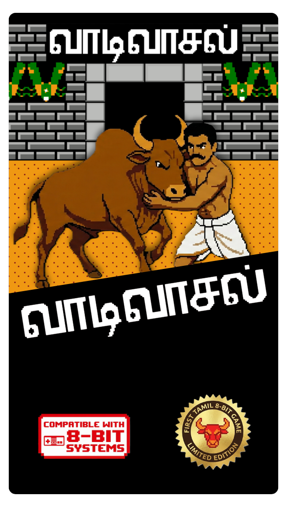

# Vaadivasal (வாடிவாசல்) - The First Tamil 8-Bit Game



> **"Tame the Bull. Honor the Tradition."**

**Vaadivasal** is an 8-bit homebrew game developed for the Nintendo Entertainment System (NES) / Famiclone. It is a digital tribute to the ancient Tamil sport of **Jallikattu**. The game puts you in the shoes of a young tamer facing 25 legendary bulls in the Alanganallur arena.

This project marks a historic milestone as the **First 8-Bit Game developed entirely in the Tamil language**.

---

### **Play Now**
Experience the world's first Tamil 8-bit game on your browser:

**[Play Vaadivasal Online](https://dineshrichard.itch.io/vaadivasal)**

---

## 🎮 Game Features
* **Full Tamil Localization:** Menus, gameplay, and instruction manuals are available in Tamil.
* **Authentic Gameplay:** Wait for the bull to tire, then catch the bull.
* **Reflex Action:** A mix of arcade-style dodging and intense Quick Time Events (QTE).
* **25 Levels:** Face bulls with increasing difficulty, from slow moving Bulls to the fierce Bulls.
* **Retro Aesthetics:** Authentic 8-bit pixel art and chiptune soundtrack.

---

## 🕹️ Controls

| Button | Action |
| :--- | :--- |
| **D-Pad** | **Move** (Avoid the charging bull) |
| **A, B, D-Pad** | **QTE** (Press the button quickly to catch the bull) |
| **Start** | **Pause / Resume** |
| **Select** | *Not Used* |

### **How to Win**
1.  **Dodge & Wait:** The bull enters with full energy. Avoid it until it stops and **blinks**.
2.  **Grab:** Run to hold the bull.
3.  **The Lock (QTE):** A sequence of 5 buttons will flash on screen. Press them exactly to tame the beast.

---

## 🛠️ Project Structure

This repository is organized for professional NES development using **cc65**.

```text
Vaadivasal-NES/
│
├── src/                      # Source Code (.s assembly files)
│   ├── main.s                # Main Game Engine
│   ├── header.s              # iNES Header configuration
│   ├── famistudio_ca65.s     # Sound Engine Driver (FamiStudio)
│   ├── Vaadivasal_Sounds.s   # Music Data (Exported from FamiStudio)
│   └── NoteTables/           # Binary lookup tables for sound engine
│
├── include/                  # Header files
│   ├── nes.inc               # Hardware definitions
│   └── constants.inc         # Game rules and tuning values
│
├── assets/                   # Game Assets
│   ├── gfx/                  # Graphics (CHR, Palettes, Nametables)
│   └── maps/                 # Background Layouts
│
├── tools/                    # Build Scripts
│   └── build.bat             # Windows Batch script to compile the game
│
├── docs/                     # Manuals
│   └── manual.pdf            # Printable Instruction Booklet
│
├── extras/                   # Raw source files (WAV, PNG) - Not used in build
│
└── nes.cfg                   # Memory Configuration for Linker
```

## 🚀 How to Build

To compile this game from source, you need the **cc65** compiler suite.

### **Prerequisites**
1. Download and install [cc65](https://cc65.github.io/).
2. Add `cc65/bin` to your System PATH variables.

### **Build Steps**
1. **Clone the repository:**
   
   git clone [https://github.com/DineshRichard/Vaadivasal-NES.git](https://github.com/DineshRichard/Vaadivasal-NES.git)

2. **Navigate to the tools folder and run the build script:**
   
   cd Vaadivasal-NES/tools   
   build.bat
 
3. **Locate the ROM:**
   If successful, the ROM file will appear in: `build/Vaadivasal.nes`

---

## 📜 Credits

* **Developer:** Dinesh Richard
* **Pixel Art & Graphics:** Dinesh Richard
* **Music & SFX:** Dinesh Richard

### **Tools Used**
* **Code:** cc65 (6502 Assembly)
* **Music:** FamiStudio
* **Graphics:** YY-CHR & NES Screen Tool
* **Emulator:** Mesen
* **IDE:** Visual Studio Code

---

## 📺 Follow the Development

I am documenting the entire journey of creating this game on my YouTube channel. Watch the **"Making of Vaadivasal"** video here:

[**▶ Click Here to Watch on YouTube**](https://youtu.be/n5p30030nUk)

---

*© 2026 Dinesh Richard. This is an independent homebrew project and is not affiliated with Nintendo Co., Ltd.*
